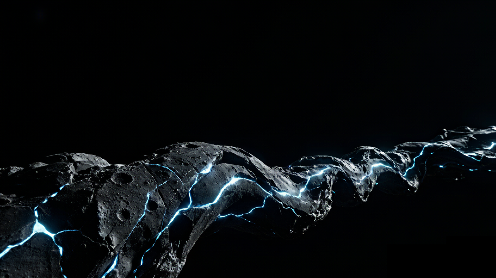

# PROJECT HADES — Deep Space Archive

   

一个以「深空残响」为背景的**交互式叙事单页网站**——用纯前端技术还原科幻电影的沉浸感。



---

## ✦ 项目简介

**PROJECT HADES** 是一场设定在 2087 年的深空考古叙事体验。

用户以「极限轨道降落下幸存者」的视角，通过滚动、点击热点、打开档案等交互动作，逐步拼凑出「哈迪斯计划」背后的真相——一次本该采集能源的远征，为何在信号消失前传回了那段诡异的录音……

> 「我们不是来采矿的。我们是被派来**确认它是否还醒着**的。」

---

## ✦ 核心特性

| 特性 | 说明 |
|------|------|
| **单文件架构** | 所有 CSS + JS + 内容内联于 `index_v2.html`，零依赖，直接打开即用 |
| **双语支持** | 内置 EN / 中文 切换，全部文案两套语言完整覆盖 |
| **滚动叙事** | `scroll-snap` 分屏结构，四幕式叙事节奏（到达 → 勘探 → 记录 → 真相） |
| **热点交互** | 可点击的热点区域，点击后触发扫描动画 + 信号恢复打字机效果 |
| **Lore 档案系统** | 独立 Overlay 层，内嵌完整世界观设定（10 章 Markdown 渲染） |
| **电影级动效** | 标题光泽扫过、矿石呼吸、按钮信标脉冲、视差滚动等 10+ 自定义动画 |
| **视频背景** | 首屏全屏深空视频背景，带多重渐变遮罩叠加 |
| **响应式布局** | `clamp()` + 媒体查询，`320px ~ 1920px+` 全区间适配 |

---

## ✦ 技术栈

```
核心架构    单文件 HTML5（零框架依赖）
样式        CSS3（自定义属性、动画、scroll-snap）
脚本        Vanilla JavaScript（ES6+）
字体        Google Fonts（Cinzel / Cormorant Garamond / Exo 2 / Marcellus）
语言        I18N 词典系统（data-i18n 属性驱动）
渲染        Markdown → HTML 行级状态机解析器（renderMarkdown）
```

---

## ✦ 文件结构

```
project-hades/
├── index_v2.html          # 主文件（HTML + CSS + JS 全部内联）
├── assets/
│   ├── 星骸基底.png      # 背景基底图
│   ├── 星骸生晶.png      # 矿石晶体质感图
│   └── 深空巨舰.mp4      # 首屏视频背景
├── .gitignore
└── README.md              # 本文件
```

> **部署提示**：将整个文件夹放到任意静态服务器即可，或直接用浏览器打开 `index_v2.html`。

---

## ✦ 本地运行

### 方式一：直接打开（最简单）
双击 `index_v2.html`，浏览器中即可运行。

### 方式二：本地服务器（推荐）
```bash
# Python
cd project-hades && python -m http.server 3000

# Node.js
npx serve .
```
然后访问 `http://localhost:3000`

### 方式三：在线部署
已部署至 GitHub Pages：  
**https://wangjiuyi543-ui.github.io/project-hades/**  
（若未开启 Pages，可手动在仓库 Settings → Pages 中启用）

---

## ✦ 叙事结构

```
第一幕 [01]  到达残骸区
        ↓
第二幕 [02]  勘探晶矿样本
        ↓
第三幕 [03]  打开船员记录
        ↓
第四幕 [04]  信号恢复…真相浮现
```

每幕对应一个 `scroll-snap` 全屏区块，配有独立视觉主题与交互热点。

---

## ✦ 定制化指南

### 修改文案
搜索 `data-i18n="xxx"`，在 JS 区域的 `i18nDict` 对象中修改对应 EN/CN 字段。

### 修改配色
在 CSS `:root` 中调整 `--mx`、`--my` 等自定义属性，或直接覆盖各动画的 `rgba()` 色值。  
主色调：`rgba(100, 180, 255, ...)`（深空蓝）

### 替换媒体资源
将新文件放入 `assets/` 文件夹，然后修改 `index_v2.html` 中对应的 `src` 路径即可。

### 修改 Lore 世界观
在 HTML 中搜索 `<script type="text/markdown" id="loreMd">`，直接编辑其中的 Markdown 文本。

---

## ✦ 开发日志

| 版本 | 日期 | 说明 |
|------|------|------|
| v1 | 2026-06 | 初始版本，基础单页结构 |
| v2 | 2026-07-02 | P0-P3 全优先级优化：可移植性修复、动画力度增强、导航状态、SEO、Lore 数据源统一 |

---

## ✦ 致谢

- 字体：Google Fonts
- 灵感来源：*Alien* / *Event Horizon* / *Solaris* 视觉语言
- 项目由 **vibe coding** 方式构建（AI 辅助创作）

---

## ✦ 许可

MIT License —— 自由使用、修改和分发。  
（媒体资源请自行确保版权合规）

---

> Built with ☕ and a dash of cosmic horror.
